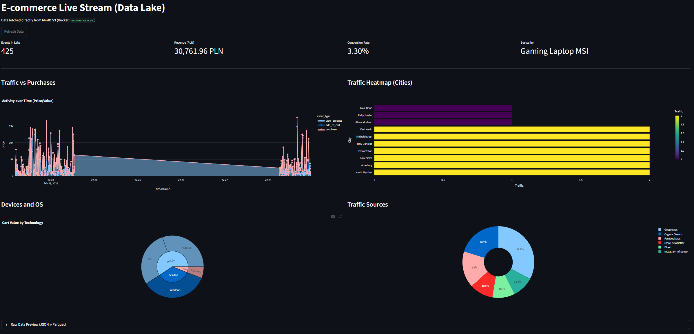

# Real-Time E-commerce Clickstream Pipeline



An end-to-end Data Engineering project that simulates, processes, and visualizes real-time user behavior on an e-commerce platform. 

This pipeline demonstrates the transition from traditional batch processing to a real-time streaming architecture using industry-standard Big Data tools.

## Architecture


The project implements a modern streaming Data Lakehouse architecture:

1. **Data Generation (Producer):** A Python script simulates continuous user traffic (views, cart additions, purchases) with rich metadata (demographics, traffic sources, device types) and sends it as JSON payloads.
2. **Message Broker (Ingestion):** **Apache Kafka** buffers the incoming data stream, decoupling the data source from the processing engine.
3. **Stream Processing:** **Apache Spark (Structured Streaming)** consumes the Kafka stream, parses the JSON payloads, and applies temporal partitioning.
4. **Data Lake (Storage):** Processed events are continuously appended to a **MinIO** object storage (S3-compatible) in **Parquet** format, partitioned by year, month, day, and hour.
5. **Analytics (Dashboard):** A **Streamlit** application connects directly to the MinIO Data Lake to visualize near real-time metrics, sales funnels, and user demographics.

## Tech Stack

* **Language:** Python 3.10+
* **Stream Processing:** Apache Spark 3.5.0
* **Message Broker:** Apache Kafka & Zookeeper
* **Object Storage:** MinIO (S3 Compatible)
* **Containerization:** Docker & Docker Compose
* **Visualization:** Streamlit, Plotly, Pandas
* **Data Formats:** JSON (Ingestion), Parquet (Storage)

## Project Structure

* `/producer` - Contains the Python data generator script (using confluent-kafka).
* `/spark_jobs` - Contains the PySpark structured streaming job.
* `docker-compose.yaml` - Infrastructure definition.
* `dashboard_s3.py` - Streamlit analytics dashboard.
* `run_project.py` - Automated execution and orchestration script.

## How to Run

### Prerequisites
* Docker and Docker Compose installed and running.
* Python installed.

### Execution

You can launch the entire infrastructure, background processes, bucket configurations, and the dashboard with a single command. 

```bash
python run_project.py

```
